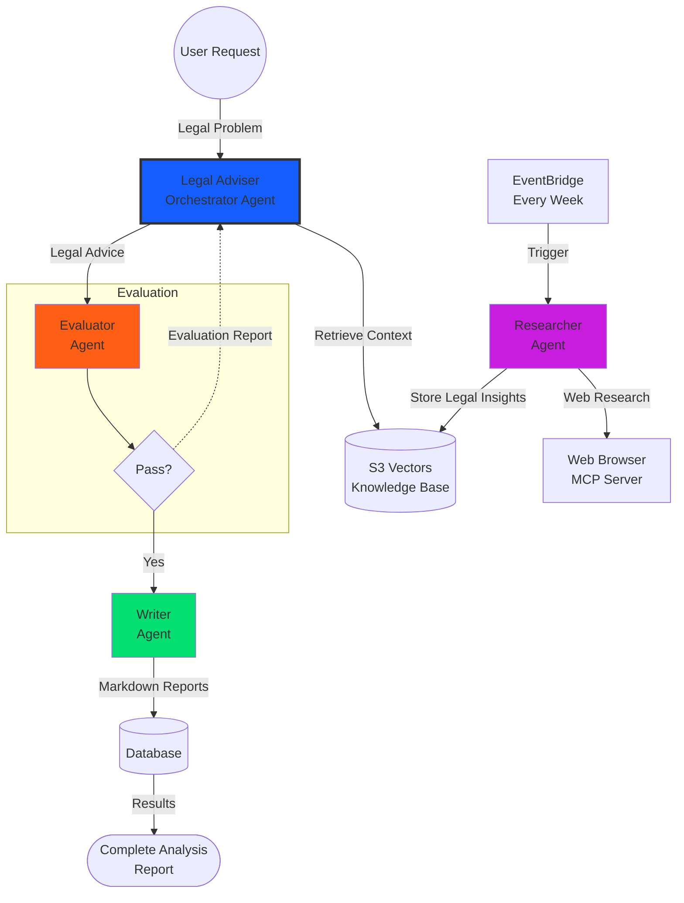

# My Legal Companion
---

This application aims at providing expert guidance on navigating complex laws and regulations, helping individuals and businesses manage risks, ensure compliance, and make informed decisions. Examples include corporate restructuring, intellectual property protection, contract drafting, employment law counseling, regulatory compliance audits, and tax advisory.

- Corporate & Business Services
- Employment & Human Resources
- Regulatory & Compliance
- Real Estate & Property
- Individuals & Personal Matters

Legal advisory is distinct from legal representation in court, focusing instead on proactive guidance to prevent litigation and ensure compliance. 

---



## Agent Responsibilities

### Legal Advisor
**Role**: This is the main orchestrator agent. This agent interacts with the user and decides the next action steps.

### Evaluator
**Role**: This agent acts as a judge to evaluate the output from the Advisor agent above.

### Writer
**Role**: The writer agent receives the output from the evalutor once the output has passed the judgement and generates a report that will be sent to the user.

### Researcher (Independent Agent)
**Role**: Autonomously gather changes and new laws.
- Runs independently on EventBridge schedule (every week)
- Not orchestrated by any agent - operates autonomously
- Browses state and law society websites for changes 
- Continuously populates S3 Vectors knowledge base
- Knowledge is later retrieved by the Legal Adviser for context


## Future Agent Enhancements

## Technology Stack

- **Infrastructure**: Terraform
- **Compute**: Lambda, App Runner
- **AI/ML**: SageMaker, AWS Bedrock
- **Storage**: S3 Vectors
- **API**: API Gateway
- **Languages**: Python 3.12, TypeScript
- **Container**: Docker

## System Architecture (Implementation)

The repository is organized as a multi-service monorepo:

- `frontend/`: Angular 20 SPA (`my-legal-companion-ui`) with Clerk authentication (`ngx-clerk`).
- `backend/api/`: FastAPI application serving authenticated `/api/*` routes and `/health`.
- `backend/database/`: Shared SQLAlchemy package used by backend services.
- `backend/assistant/`: Python service for autonomous/research workflows and tool orchestration.
- `backend/ingest/`: Ingestion utilities for S3 vectors / search indexing.
- `backend/scheduler/`: Scheduled job packaging (EventBridge/Lambda support code).
- `terraform/`: Infrastructure-as-code split by domain (`api`, `frontend`, `database`, `assistant`, `ingestion`, `sagemaker`).
- `scripts/`: Operational scripts for deployment, destroy, and local development.


## Runtime Components

### API Service (`backend/api`)

- Framework: FastAPI + Uvicorn.
- Auth: Clerk JWT validation (`fastapi-clerk-auth`).
- AI orchestration: OpenAI Agents (`openai-agents[litellm]`).
- Startup behavior:
  - Loads root `.env` during local development.
  - Initializes database on startup with timeout guard.
  - Exposes `GET /health` for runtime/health checks.

### Database Layer (`backend/database`)

- Package: `legal-companion-database`.
- ORM: SQLAlchemy (async-capable configuration).
- Driver: Psycopg.
- Cloud integration: Boto3 (for Aurora/Secrets flows).
- Includes pytest-based tests under `backend/database/tests/`.

### Frontend (`frontend`)

- Framework: Angular 20, TypeScript 5.9, RxJS 7.8.
- Auth client integration: Clerk publishable key and auth paths in environment files.
- Main scripts:
  - `npm start` (dev server)
  - `npm run build` (production build)
  - `npm test` (Karma/Jasmine unit tests)

## API Surface (Current)

Authenticated routes (Clerk token required):

- `GET /api/auth/me`: returns Clerk user/session identity.
- `POST /api/chat/messages`: submits chat turns and returns model response/evaluation/report fields.
- `POST /api/consultations`, `GET /api/consultations`: create/list consultation records for current user.
- `POST /api/case-references`, `GET /api/case-references`: create/list case references.

Public route:

- `GET /health`: basic liveness endpoint.

## Local Development

### Option A: Run everything with one command

Use the helper script from repository root:

```bash
python3 scripts/run_local.py
```

This script checks prerequisites (`node`, `npm`, `uv`), verifies env files, then runs:

- Backend at `http://localhost:8000`
- Frontend at `http://localhost:4200`
- API docs at `http://localhost:8000/docs`

### Option B: Run services manually

Backend:

```bash
cd backend/api
uv sync
uv run main.py
```

Frontend (separate terminal):

```bash
cd frontend
npm install
npm start
```


## Infrastructure and Deployment

### Terraform module responsibilities

- `terraform/database`: Aurora + related database prerequisites.
- `terraform/api`: ECR + App Runner API service + runtime IAM policies.
- `terraform/frontend`: S3 static hosting + CloudFront distribution + `/api/*` routing to App Runner.
- `terraform/assistant`: assistant service infrastructure.
- `terraform/ingestion`: ingestion and vector-storage related resources.
- `terraform/sagemaker`: embedding endpoint resources.

### CI/CD workflow (GitHub Actions)

`.github/workflows/deploy.yml` runs on `main` pushes and manual dispatch:

1. Authenticates to AWS via OIDC role assumption.
2. Installs Python 3.12 + `uv`, Terraform, and Node 20.
3. Imports existing API resources into Terraform state (`terraform/api/import_existing_resources.sh`).
4. Executes `scripts/deploy.sh`.
